# cibus-food-app

Recipe App using React + Typescript + Material UI

## Progress

### November 10, 2025

Added tags and cleaned up recipe. Next time: move fetching data elsewhere

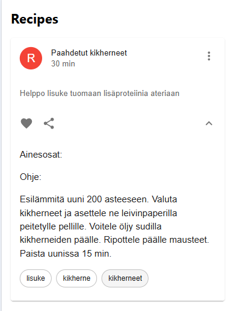

### November 9, 2025

Added recipes to state

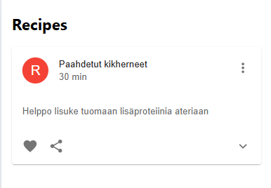

### November 8, 2025

Attaching spring boot to this project

### July 31st, 2025

After some break on the subject, I'm back at it.

This time I added react-router-dom to the project.

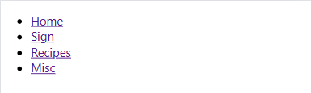

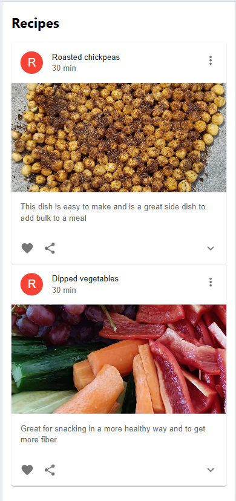

### June 5th, 2025

Removed banner, replaced it with an appbar

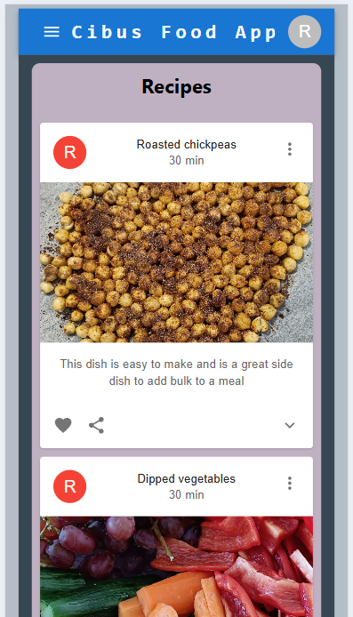

Left nav

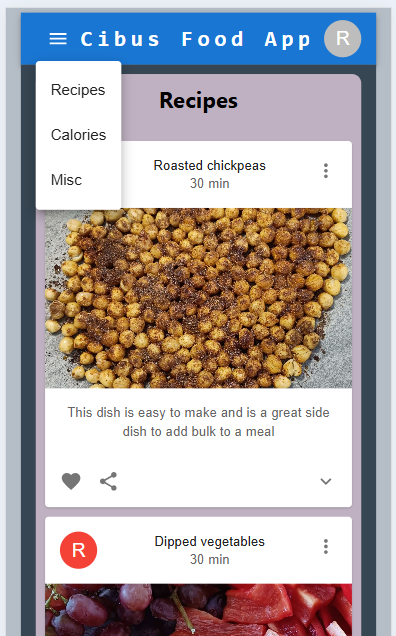

Right nav

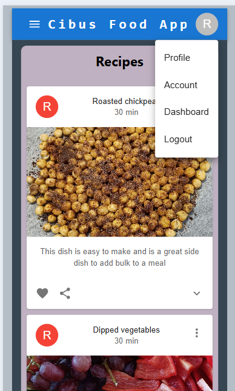

### May 12th, 2025

Fixed the layout so the recipes spread out better without leaving unnecessary space on the edges.

Used real pictures, improved banner.

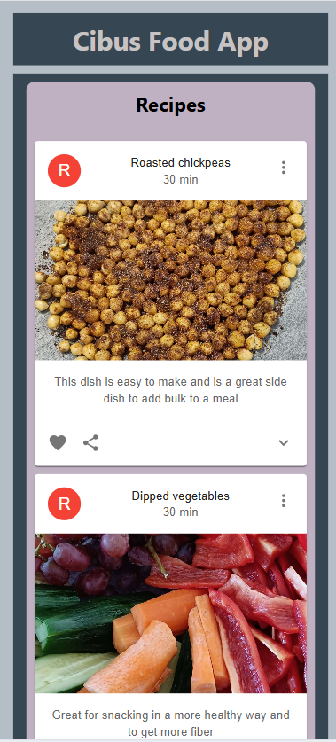

### March 23, 2025

Fixed all recipes opening when one does. Added an ingredient table to Card. Added containers

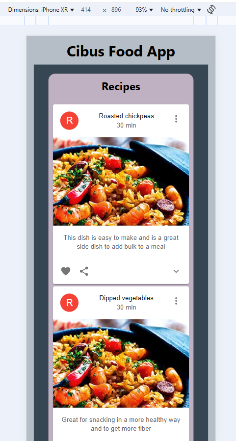

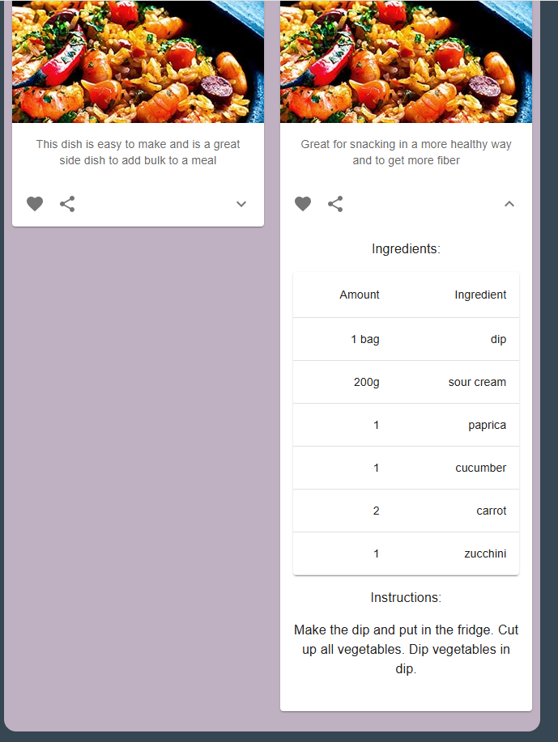

### March 21, 2025

Switched to using Material UI

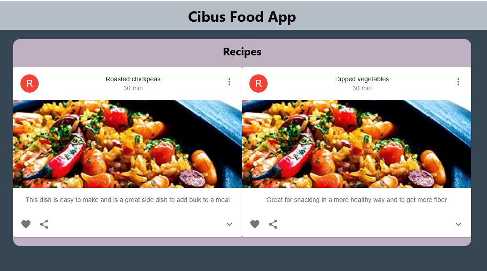

### March 19, 2025

Added media queries for pad and desktop. Desktop uses column layout for the recipes, the others rows.

### March 18, 2025

Switched to Mobile first thinking. Decided to make the recipe components appear as previews initially.
Improved CSS.

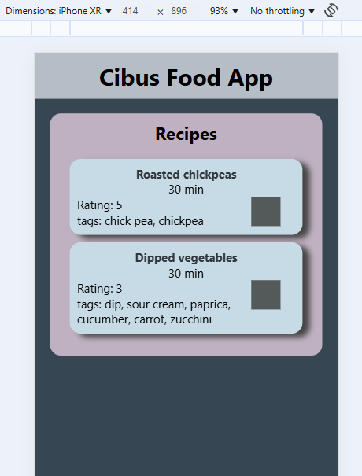

### March 17, 2025

Project created, mockdata added and some preliminary components are in place.

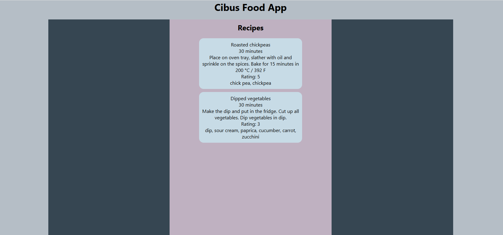
